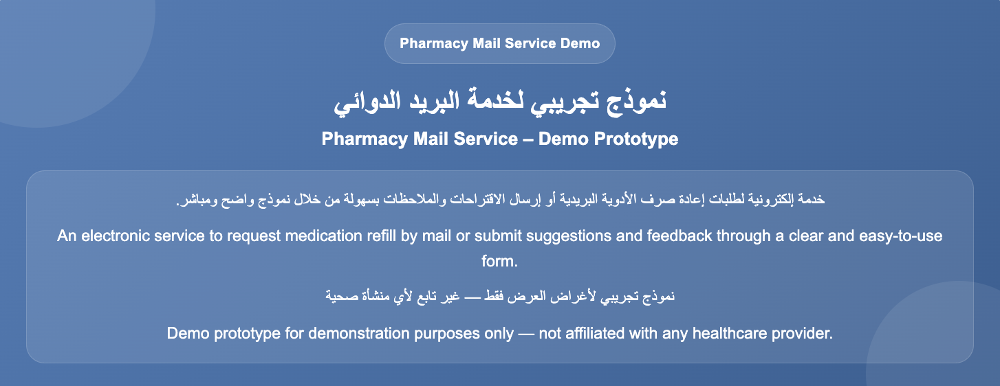

# Pharmacy Service Portal (Demo)

A bilingual (Arabic / English) pharmacy service portal prototype for medication refill requests and patient feedback, with client-side validation and a privacy-first approach to demo submissions.

## Why this exists

Refill requests and patient feedback often go through slow, paper-based, or phone-only channels. This demo shows a lightweight, bilingual, self-service alternative that patients can use directly.

## Features

- Medication refill request flow
- Patient feedback submission
- Client-side form validation
- Privacy-first demo submission (no real patient data is stored/transmitted)
- Bilingual interface (Arabic / English) with RTL-aware layout

## Tech stack

- HTML <!-- add CSS / JavaScript / frameworks here if used -->

## Getting started

```bash
git clone https://github.com/waad-alwagdani/pharmacy-service-portal-demo.git
cd pharmacy-service-portal-demo
# open index.html in your browser
```

## Screenshots



## Status

Prototype / demo — not connected to a real pharmacy system. Feedback welcome.

## License

© Waad Alwagdani. All rights reserved.

This project is shared publicly for portfolio and demonstration purposes only. No permission is granted to copy, modify, distribute, or reuse this code without prior written consent.
